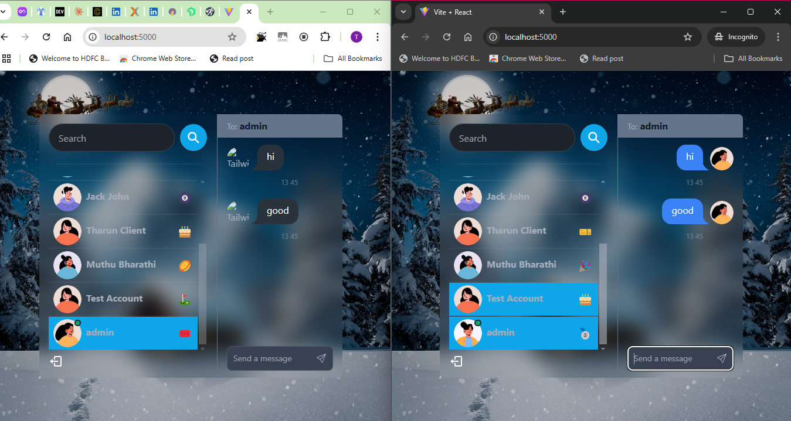

Backend
  controllers
    user.controller.js
    auth.controllers.js
    message.controller.js
  models
    user.model.js
    conversation.model.js
    message.model.js
  socket
    socket.js
  routes
    auth.routes.js
    message.routes.js
    user.routes.js
  utils
    generateTokenAndSetCookie.js
  middleware
    protectedRoutes.js
  db
    connectToMongoDB.js
  server.js

Frontend
  src
    assets
    components
      messages
        MessageContainer
        MessageInput
        Messages
      sidebar
        Conversations
        Conversation
        SearchInput
        LogoutButton
      Skeleton
        MessageSkeleton
    pages
      home
      login
      signup
    hooks
      useGetConversations.js
      useLogin.js
      useLogout.js
      useGetMessages.js
      useListenMessages.js
      useGetMessages.js
      useSendMessage.js
    Zustand
      useConversations.js
    utils
      emojis.js
      exactTime.js
    Context
      AuthContext
      SocketContext
    main.jsx
    index.css
    App.jsx
    

  
