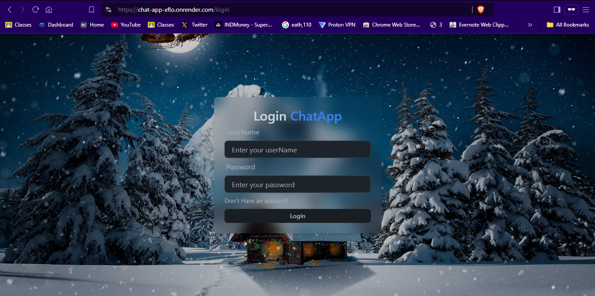
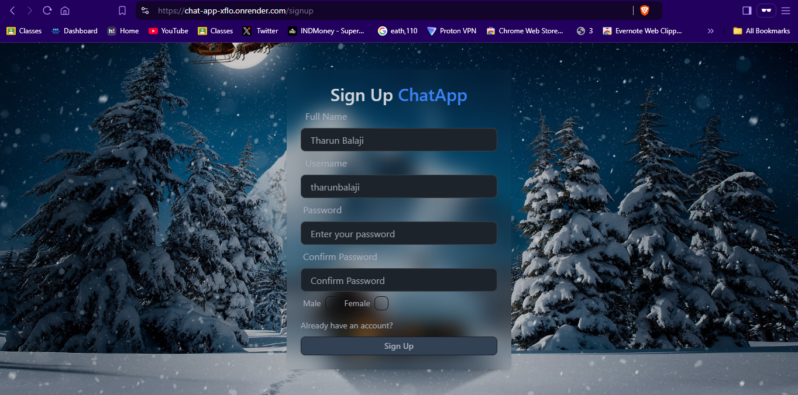
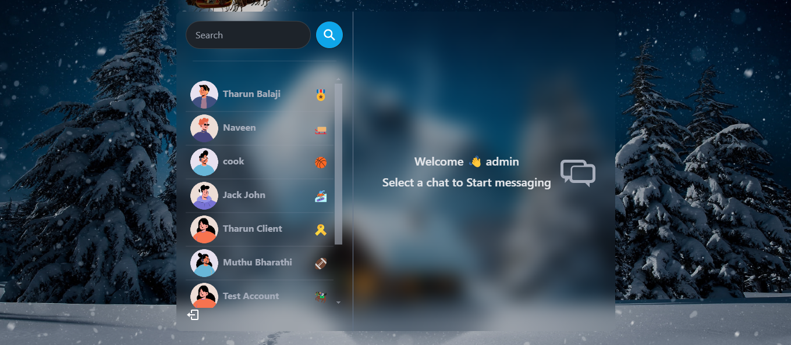
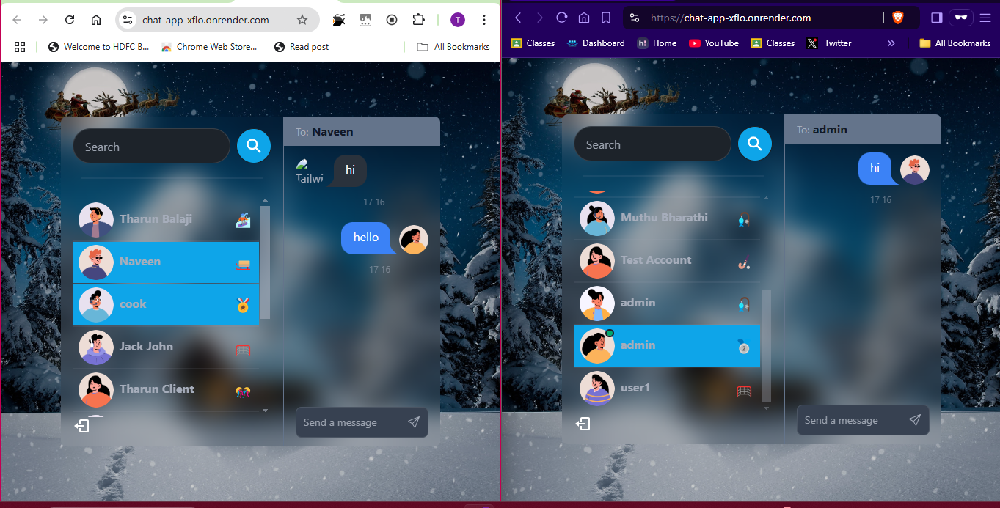

# Real-Time Chat Application

## 🚀 Project Overview

This is a full-stack real-time chat application built using the MERN stack (MongoDB, Express.js, React, Node.js) with additional technologies like Socket.IO for real-time communication, Zustand for state management, and Tailwind CSS for styling.

## 🛠 Technologies Used

- **Frontend**: React, Tailwind CSS, Daisy UI
- **Backend**: Node.js, Express.js
- **Database**: MongoDB
- **Real-Time Communication**: Socket.IO
- **State Management**: Zustand
- **Authentication**: JWT (JSON Web Tokens)

## 📂 Project Structure

### Backend Folder Structure
```
Backend/
│
├── controllers/
│   ├── user.controller.js
│   ├── auth.controllers.js
│   └── message.controller.js
│
├── models/
│   ├── user.model.js
│   ├── conversation.model.js
│   └── message.model.js
│
├── routes/
│   ├── auth.routes.js
│   ├── message.routes.js
│   └── user.routes.js
│
└── middleware/
    └── protectedRoutes.js
```

### Frontend Folder Structure
```
Frontend/
│
├── src/
│   ├── components/
│   ├── pages/
│   ├── hooks/
│   ├── context/
│   └── zustand/
```

## 🔐 Authentication Middleware

The application uses a protected route middleware to secure routes:

```javascript
export default async function protectRoute(request, response, next) {
    try {
        const token = request.cookies.jwt;
        if (!token) {
            return response.status(401).json({
                error: "Unauthorized - No Token provided",
            });
        }

        const decoded = jwt.verify(token, process.env.JWT_SECRET);
        const user = await User.findById(decoded.userId).select("-password");

        if (!user) {
            return response.status(401).json({
                error: "User not found"
            });
        }

        request.user = user;
        next();
    } catch (error) {
        response.status(500).json({
            error: "Internal Server Error",
        })
    }
}
```

## 📊 Data Models

### User Model
```javascript
const userSchema = new mongoose.Schema({
    fullName: { type: String, required: true },
    username: { type: String, required: true, unique: true },
    password: { type: String, required: true, minlength: 6 },
    gender: { type: String, required: true, enum: ["male","female"] },
    profilePic: { type: String, default: "" }
}, { timestamps: true });
```

### Message Model
```javascript
const messageSchema = new mongoose.Schema({
    senderId: { type: mongoose.Schema.Types.ObjectId, ref: "User", required: true },
    receiverId: { type: mongoose.Schema.Types.ObjectId, ref: "User", required: true },
    message: { type: String, required: true }
}, { timestamps: true });
```

## 🌐 Real-Time Socket Connection

The socket implementation manages real-time user connections:

```javascript
const userSocketMap = {};

io.on("connection", (socket) => {
    const userId = socket.handshake.query.userId;
    if (userId !== "undefined") {
        userSocketMap[userId] = socket.id;
    }

    // Emit online users
    io.emit("getOnlineUsers", Object.keys(userSocketMap));

    socket.on("disconnect", () => {
        delete userSocketMap[userId];
        io.emit("getOnlineUsers", Object.keys(userSocketMap));
    });
});
```

## 🔑 Key Routes

### Authentication Routes
- `/login`
- `/logout`
- `/signup`

### Message Routes
- `GET /:id` - Get messages
- `POST /send/:id` - Send a message

### User Routes
- `GET /` - Get users for sidebar

## 🚦 Frontend Routing
```javascript
<Routes>
    <Route
        path="/"
        element={authUser ? <Home /> : <Navigate to={"/login"} />}
    />
    <Route
        path="/login"
        element={authUser ? <Navigate to="/" /> : <Login />}
    />
    <Route
        path="/signup"
        element={authUser ? <Navigate to="/" /> : <SignUp />}
    />
</Routes>
```

## 🖼️ Preview

### Login Page


### Signup Page


### Home Page


### Real time Messaging



## 🔗 Live Demo

[Chat App](https://chat-app-xflo.onrender.com/)

## 🤝 Contributing

1. Fork the repository
2. Create your feature branch (`git checkout -b feature/AmazingFeature`)
3. Commit your changes (`git commit -m 'Add some AmazingFeature'`)
4. Push to the branch (`git push origin feature/AmazingFeature`)
5. Open a Pull Request

## 📄 License

Distributed under the MIT License. See [`LICENSE`](LICENSE.md) for more information.

## 📧 Contact

Tharun Balaji- [tharunbalaji110@gmail.com](mailto:tharunbalaji110@gmail.com)

Project Link: [https://github.com/Tharun-Balaji/chat-app.git](https://github.com/Tharun-Balaji/Full-Stack/tree/main/Full_Stack_project/chat-app)
